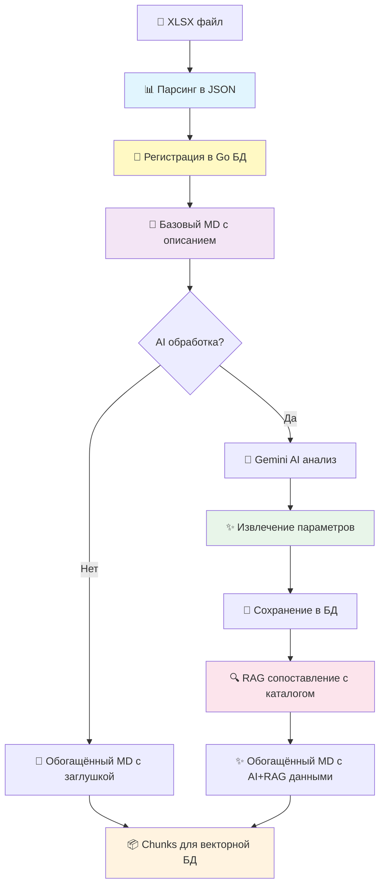

# 🚀 Анализатор тендерной документации

[](https://python.org)
[](https://fastapi.tiangolo.com/)
[](https://docs.celeryq.dev/)
[](https://ai.google.dev)
[](https://redis.io/)

## 📖 Описание проекта

**Parser Tender XLSX** — это интеллектуальная система автоматизации обработки тендерной документации в строительной отрасли. Проект решает критическую задачу современных строительных компаний: быструю и точную обработку больших объёмов тендерной документации с извлечением структурированных данных и их интеллектуальным анализом.

### 🎯 Проблематика

В строительной отрасли тендерная документация представляет собой сложные Excel-таблицы, содержащие:
- Десятки и сотни позиций работ с техническими описаниями
- Объёмы, единицы измерения, материалы и характеристики
- Информацию о подрядчиках, сроках и условиях выполнения
- Разнородные форматы представления одних и тех же данных

Ручная обработка такой документации занимает часы работы специалистов, подвержена ошибкам и не масштабируется при росте объёмов.

### 💡 Решение

Наша система полностью автоматизирует процесс обработки тендеров:

1. **Интеллектуальный парсинг** - извлекает данные из сложных Excel-таблиц с учётом объединённых ячеек, многоуровневых заголовков и различных форматов
2. **AI-классификация** - использует Google Gemini для автоматического определения категорий работ (нулевой цикл, общестроительные работы, инженерные сети и т.д.)
3. **Извлечение параметров** - выделяет ключевые технические характеристики из текстовых описаний (объёмы, марки материалов, диаметры труб, глубины заложения и др.)
4. **RAG-сопоставление** - автоматически сопоставляет позиции с нормативными каталогами строительных работ, используя **Google File Search Store** (Corpus-based RAG) для высокой точности и масштабируемости
5. **Структурированный вывод** - формирует единообразные данные для дальнейшей аналитики, оценки стоимости и планирования

### 🌟 Ценность для бизнеса

- **Экономия времени**: сокращение времени обработки одного тендера с 2-4 часов до 5-10 минут
- **Точность**: минимизация человеческих ошибок при переносе данных
- **Масштабируемость**: параллельная обработка десятков тендеров одновременно
- **Аналитика**: структурированные данные для анализа рынка, оценки конкурентов и прогнозирования
- **Стандартизация**: приведение данных из разных источников к единому формату

### 🔧 Технологический стек

Производственная асинхронная система построена на современных технологиях:
- **FastAPI + Celery + Redis** - масштабируемая асинхронная обработка с очередями задач
- **Google Gemini 1.5 Pro** - state-of-the-art AI модель для анализа и классификации
- **Google File Search API** - RAG-технология для интеллектуального поиска по каталогам
- **Go Backend Integration** - интеграция с основной базой данных через REST API
- **Модульная архитектура** - разделение ответственности, легкость расширения и тестирования

## ✨ Ключевые возможности

### 🏗️ **Архитектура**

- **FastAPI** - асинхронный REST API сервер с высокой производительностью
- **Celery** - распределённая фоновая обработка задач с очередями и приоритетами
- **Redis** - быстрый брокер сообщений и хранилище статусов задач
- **Go Backend Integration** - интеграция с основной БД через асинхронный HTTP клиент с connection pooling
- **Модульная структура** - разделение воркеров по типам задач, легкость масштабирования

### 🤖 **AI-анализ и RAG**

- **Google Gemini 2.5 Flash** - быстрая и точная модель для RAG-поиска
- **Corpus-based RAG** - использование постоянного хранилища (File Search Store) вместо загрузки файлов при каждом запросе
- **Event-driven Indexing** - автоматическая индексация новых позиций сразу после импорта тендера
- **Scheduled Deduplication** - ночная задача для поиска и устранения дубликатов в каталоге
- **Автоматическая категоризация** - определение типов работ (13+ категорий)
- **Извлечение технических параметров** - автоматическое выделение объёмов, материалов, характеристик
- **NLP обработка** - использование spaCy и русских моделей для обработки естественного языка

### 🚀 **Функциональность**

- **Асинхронная загрузка** файлов через REST API с валидацией формата
- **Двухэтапная обработка**: парсинг Excel → AI анализ → RAG сопоставление с каталогами
- **Отслеживание статуса** задач в реальном времени через WebSocket и REST API
- **Мониторинг воркеров** через Flower dashboard и API эндпоинты
- **Структурированное логирование** всех этапов обработки с раздельными логами по модулям
- **Обработка ошибок** с retry механизмами, exponential backoff и fallback режимами
- **Масштабируемость** - горизонтальное масштабирование воркеров, поддержка высоких нагрузок

### 📊 **Примеры использования**

#### Кейс 1: Обработка тендера на строительство жилого комплекса
```
Входные данные: Excel файл на 150+ позиций работ
Время обработки: 8 минут
Результат:
  ✓ 150 позиций автоматически классифицированы по категориям
  ✓ Извлечено 450+ технических параметров
  ✓ 85% позиций сопоставлены с нормативным каталогом
  ✓ Сформированы структурированные отчёты в Markdown и JSON
```

#### Кейс 2: Пакетная обработка конкурентных предложений
```
Входные данные: 5 Excel файлов от разных подрядчиков
Параллельная обработка: все файлы одновременно
Результат:
  ✓ Единый формат данных для всех предложений
  ✓ Возможность автоматического сравнения цен и объёмов
  ✓ Выявление расхождений в спецификациях
```

#### Кейс 3: Интеграция в корпоративную систему
```
Сценарий: Автоматическая обработка входящих тендеров
  ↓ Новый тендер поступает в систему
  ↓ Автоматический парсинг и AI-анализ
  ↓ Сохранение в корпоративную БД через Go API
  ↓ Уведомление ответственных специалистов
  ↓ Готовые данные для формирования коммерческого предложения
```

### 🎨 **Архитектурные особенности**

#### Производительность и масштабируемость
- **Connection Pooling** - переиспользование HTTP соединений с Go backend
- **Асинхронная обработка** - non-blocking I/O операции на всех уровнях
- **Параллельная обработка лотов** - независимые Celery задачи для каждого лота тендера
- **Кэширование результатов** - Redis для быстрого доступа к статусам задач
- **Horizontal Scaling** - возможность запуска множества воркеров на разных серверах

#### Надёжность
- **Retry механизмы** - автоматические повторные попытки при временных сбоях
- **Fallback режимы** - работа при недоступности внешних сервисов
- **Graceful degradation** - частичная обработка при ошибках в отдельных лотах
- **Structured logging** - детальное логирование для отладки и аудита
- **Health checks** - эндпоинты для мониторинга состояния системы

#### Расширяемость
- **Модульная архитектура** - чёткое разделение ответственности между модулями
- **Plugin-based воркеры** - легко добавлять новые типы обработки
- **Конфигурируемые промпты** - AI поведение настраивается через Python модули
- **Многоуровневая обработка** - возможность добавления новых этапов в пайплайн

## 🏁 Быстрый старт

### 📦 Установка

```bash
# Клонирование репозитория
git clone https://github.com/zhukovvlad/parser_tender_xlsx.git
cd parser_tender_xlsx

# Создание виртуального окружения
python -m venv .venv
source .venv/bin/activate  # Linux/Mac

# Установка зависимостей
pip install -r requirements.txt

# Установка русской модели spaCy
python -m spacy download ru_core_news_sm

# Проверка Redis (должен быть установлен в системе)
redis-cli ping  # Должен вернуть PONG
```

### ⚙️ Настройка

Создайте файл `.env` в корне проекта:

```bash
# Google AI API
GOOGLE_API_KEY=your_gemini_api_key_here
GOOGLE_RAG_MODEL=gemini-2.5-flash  # Рекомендуемая модель для RAG
GOOGLE_RAG_STORE_ID=rag-catalog-store  # ID хранилища (корпуса)

# RAG Настройки
RAG_MATCHING_THRESHOLD=0.95  # Порог схожести для сопоставления
RAG_SUGGEST_THRESHOLD=0.98   # Порог для поиска дубликатов
RAG_CLEANER_BATCH_SIZE=1000  # Размер батча индексации
RAG_MATCHER_BATCH_SIZE=100   # Размер батча сопоставления

# Go Backend Server
GO_SERVER_API_ENDPOINT=http://localhost:8080/api/v1
GO_SERVER_API_KEY=your_go_server_key_here  # опционально

# Redis настройки
REDIS_HOST=localhost
REDIS_PORT=6379
REDIS_URL=redis://localhost:6379/0

# Логирование
LOG_LEVEL=INFO
GEMINI_LOG_LEVEL=INFO
RAG_LOG_LEVEL=INFO  # отдельный уровень для RAG модуля

# TTL для статусов задач (в секундах)
STATUS_TTL_SECONDS=7200

# HTTP таймауты
GO_HTTP_TIMEOUT=60

# Режим отладки
SAVE_DEBUG_FILES=false
PARSER_FALLBACK_MODE=false
```

### 🚀 Запуск системы

#### Способ 1: Автоматический запуск всех сервисов

```bash
make start-all
```

Эта команда запустит:
- Redis (если не запущен)
- Celery Worker (фоновая обработка)
- Celery Beat (планировщик)
- FastAPI приложение (API сервер)

#### Способ 2: Ручной запуск компонентов

```bash
# Терминал 1: Celery Worker
celery -A app.celery_app worker --loglevel=INFO

# Терминал 2: Celery Beat (опционально)
celery -A app.celery_app beat --loglevel=INFO

# Терминал 3: FastAPI сервер
uvicorn main:app --host 0.0.0.0 --port 8000 --reload
```

#### Остановка сервисов

```bash
make stop-all
```

### 📤 Использование API

```bash
# Загрузка и парсинг файла (без AI)
curl -X POST "http://localhost:8000/parse-tender/" \
     -F "file=@tender.xlsx" \
     -F "enable_ai=false"

# Ответ:
{
  "task_id": "550e8400-e29b-41d4-a716-446655440000",
  "message": "Задача по обработке файла принята (без AI)",
  "enable_ai": false,
  "filename": "tender.xlsx"
}

# Загрузка с AI-анализом
curl -X POST "http://localhost:8000/parse-tender/" \
     -F "file=@tender.xlsx" \
     -F "enable_ai=true"

# Проверка статуса задачи
curl "http://localhost:8000/tasks/{task_id}/status"

# Ответ:
{
  "state": "SUCCESS",
  "status": "Task completed successfully",
  "result": {
    "tender_id": "123",
    "lots_processed": 2
  },
  "error": null
}

# Проверка здоровья системы
curl "http://localhost:8000/health"

# Статус Celery воркеров
curl "http://localhost:8000/celery-workers/status"
```

## 🏗️ Архитектура системы

### 📊 Пайплайн обработки



### 📁 Создаваемые файлы

Система создаёт несколько типов файлов на разных этапах обработки:

```text
📂 temp_uploads/               # Временные загрузки (автоматически очищается)
├── {task_id}.xlsx

📂 tenders_json/               # Полные JSON данные тендеров
├── {tender_id}.json

📂 tenders_positions/          # Шаг 1: Детализированные позиции для AI
├── {tender_id}_{lot_id}_positions.md

📂 tenders_md_base/            # Шаг 2: Базовый MD из JSON
├── {tender_id}_{lot_id}_base.md

📂 tenders_md/                 # Шаг 3: Обогащённый MD с ключевыми параметрами
├── {tender_id}_{lot_id}.md

📂 tenders_chunks/             # Шаг 4: Chunks для векторной БД
└── {tender_id}_{lot_id}_chunks.json

📂 pending_sync_json/          # Fallback: данные для отложенной синхронизации
    └── ai_results/
        └── {lot_id}_{timestamp}.json
```

📂 tenders_md/                 # Шаг 3: Обогащённый MD с ключевыми параметрами
├── {tender_id}_{lot_id}.md

📂 tenders_chunks/             # Шаг 4: Chunks для векторной БД
└── {tender_id}_{lot_id}_chunks.json
```

### 🔄 Workflow обработки

#### **Процесс 1: Парсинг и AI обработка** (`parse_with_gemini.py`)

1. **📤 Загрузка XLSX** → FastAPI принимает файл через `/parse-tender/`
2. **📊 Парсинг Excel** → Извлечение структурированных данных в JSON
3. **💾 Регистрация в Go БД** → Отправка через `GoApiClient`, получение реальных DB ID
4. **📝 Создание positions** → Файлы с детализацией для AI обработки
5. **📄 Базовый MD** → Полное описание тендера в Markdown (из JSON)
6. **🤖 AI обработка** → Gemini анализирует позиции (опционально, параллельно)
   - Классификация работ по категориям
   - Извлечение ключевых параметров (объемы, материалы, характеристики)
   - Сохранение результатов в Go БД через `update_lot_ai_results_sync()`
7. **🔧 Обогащённый MD** → MD с ключевыми параметрами + AI данными
8. **📦 Chunks** → Разбивка на смысловые части для векторной БД

#### **Процесс 2: RAG сопоставление** (в разработке, `rag_google_module`)

1. **🔍 Получение необработанных позиций** → Запрос к Go БД (`get_unmatched_positions`)
2. **📚 Инициализация каталога** → Загрузка JSONL файла в Google File Search
3. **🔎 Поиск совпадений** → RAG-поиск через `FileSearchClient.search()`
4. **💾 Обновление БД** → Сопоставление позиций с каталогом через `update_position_mapping()`

### 🎯 Основные модули

#### `app/parse_with_gemini.py`
Главная функция пайплайна - `parse_file_with_gemini()`:
- Оркестрирует весь процесс обработки
- Поддерживает синхронный и асинхронный режимы
- Интегрируется с Celery для фоновой обработки
- Создаёт все необходимые артефакты

#### `app/go_module/`
Асинхронный HTTP клиент для интеграции с Go backend:
- `go_client.py` - `GoApiClient` с connection pooling
- `sync_wrapper.py` - синхронные обертки для Celery воркеров
- Централизованная обработка ошибок и логирование
- Поддержка fallback режима при недоступности сервера

#### `app/rag_google_module/`
RAG-поиск через Google File Search API:
- `file_search.py` - `FileSearchClient` для работы с Google AI
- **Corpus-based RAG**: использование постоянного хранилища (Store) вместо загрузки файлов при каждом запросе
- Асинхронная обработка с правильным использованием `aio` namespace
- Структурированное логирование в `logs/rag_google.log`

#### `app/workers/gemini/`
Celery воркеры для AI обработки:
- `tasks.py` - Celery задачи для фоновой обработки
- `worker.py` - бизнес-логика AI анализа
- `manager.py` - управление задачами и статусами
- `integration.py` - интеграция с Go API

### 📁 Структура проекта

```text
parser_tender_xlsx/
├── 🎯 main.py                     # FastAPI приложение
├── 📄 requirements.txt            # Python зависимости
├── 📄 Makefile                    # Команды для разработки
├── 📄 .env                        # Конфигурация
│
├── 📂 app/                        # Основная логика
│   ├── 📄 parse_with_gemini.py    # Основной пайплайн (Процесс 1)
│   ├── 📄 celery_app.py           # Конфигурация Celery
│   │
│   ├── 📂 excel_parser/           # Excel обработка
│   │   ├── 📄 get_lot_positions.py   # Извлечение позиций
│   │   ├── 📄 read_contractors.py    # Парсинг подрядчиков
│   │   └── 📄 postprocess.py         # Постобработка данных
│   │
│   ├── 📂 gemini_module/          # AI обработка
│   │   ├── 📄 processor.py        # TenderProcessor класс
│   │   ├── 📄 constants.py        # Категории и конфигурации
│   │   └── 📄 config.py           # Настройки модели
│   │
│   ├── 📂 go_module/              # Интеграция с Go backend
│   │   ├── 📄 go_client.py        # GoApiClient (async HTTP)
│   │   ├── 📄 sync_wrapper.py     # Синхронные обертки
│   │   └── 📄 logger.py           # Логирование
│   │
│   ├── 📂 rag_google_module/      # RAG поиск (Процесс 2)
│   │   ├── 📄 file_search.py      # FileSearchClient (Google AI)
│   │   └── � logger.py           # Логирование RAG
│   │
│   ├── �📂 workers/                # Celery воркеры
│   │   ├── 📂 gemini/             # Gemini AI worker
│   │   │   ├── 📄 tasks.py        # Celery задачи
│   │   │   ├── 📄 worker.py       # Бизнес-логика AI
│   │   │   ├── 📄 manager.py      # Менеджер задач
│   │   │   └── 📄 integration.py  # API интеграция
│   │   └── � parser/             # Parser worker (будущее)
│   │
│   ├── 📂 markdown_utils/         # MD генерация
│   │   ├── 📄 json_to_markdown.py        # JSON → базовый MD
│   │   ├── �📄 ai_enhanced_reports.py     # AI обогащение
│   │   └── 📄 regeneration_utils.py      # Регенерация отчетов
│   │
│   ├── 📂 markdown_to_chunks/     # Chunking для RAG
│   │   └── 📄 tender_chunker.py   # Разбивка на chunks
│   │
│   └── 📂 prompts/                # AI промпты
│       ├── 📄 classifier.py       # Классификация позиций
│       ├── 📄 zero_cycle.py       # Нулевой цикл
│       └── 📄 single_classifier.py # Единичная классификация
│
├── 📂 docs/                       # Документация
│   ├── 📄 WORKFLOW.md             # Детальное описание процессов
│   ├── 📄 PIPELINE.md             # Схемы пайплайнов
│   ├── 📄 GO_MODULE_MIGRATION.md  # История миграции на go_module
│   └── 📄 TESTING.md              # Руководство по тестированию
│
├── 📂 scripts/                    # Управляющие скрипты
│   ├── 🔧 start_services.sh       # Запуск всей системы
│   ├── 🔧 stop_services.sh        # Остановка системы
│   └── 🔧 check_report_updates.sh # Проверка обновлений
│
├── 📂 temp_uploads/               # Временные загрузки
├── 📂 tenders_json/               # JSON данные
├── 📂 tenders_positions/          # Позиции для AI
├── 📂 tenders_md_base/            # Базовые MD
├── 📂 tenders_md/                 # Обогащённые MD
├── 📂 tenders_chunks/             # Chunks для RAG
├── 📂 pending_sync_json/          # Fallback данные
└── 📂 logs/                       # Логи системы
    ├── celery-worker.pid
    ├── celery-beat.pid
    ├── flower.pid
    ├── rag_google.log
    └── go_module.log
```

## 🔧 Конфигурация

### 🔐 Переменные окружения (.env)

```bash
# ============== Google AI ==============
GOOGLE_API_KEY=your_gemini_api_key_here
GOOGLE_RAG_MODEL=gemini-2.5-flash  # Рекомендуемая модель для RAG
GOOGLE_RAG_STORE_ID=rag-catalog-store  # ID хранилища (корпуса)

# ============== Go Backend Server ==============
GO_SERVER_API_ENDPOINT=http://localhost:8080/api/v1
GO_SERVER_API_KEY=your_go_server_key_here  # опционально
GO_HTTP_TIMEOUT=60  # таймаут HTTP запросов (секунды)

# ============== Redis ==============
REDIS_HOST=localhost
REDIS_PORT=6379
REDIS_URL=redis://localhost:6379/0

# ============== Логирование ==============
LOG_LEVEL=INFO              # Основной уровень (DEBUG, INFO, WARNING, ERROR)
GEMINI_LOG_LEVEL=INFO       # Уровень для Gemini модуля
RAG_LOG_LEVEL=INFO          # Уровень для RAG модуля

# ============== TTL и таймауты ==============
STATUS_TTL_SECONDS=7200     # Время жизни статусов задач (2 часа)

# ============== Режимы отладки ==============
SAVE_DEBUG_FILES=false      # Сохранять промежуточные файлы
PARSER_FALLBACK_MODE=false  # Работа без Go сервера (временные ID)
```

## 🛠️ Утилиты и Скрипты

В папке `scripts/` находятся полезные утилиты для управления RAG-хранилищем:

- **`show_google_stores.py`** — показывает список доступных File Search Stores и документов в них.
- **`show_store_details.py`** — выводит детальную статистику по хранилищу (количество батчей, записей, примеры данных).
- **`delete_google_store.py`** — **ОСТОРОЖНО!** Полностью удаляет хранилище и все его документы (используется для сброса индекса).
  > **Внимание:** Удаление необратимо! Скрипты используют `GOOGLE_API_KEY` и `GOOGLE_RAG_STORE_ID` из вашего `.env` файла. Убедитесь, что вы работаете в нужном окружении.

Пример использования:
```bash
python scripts/show_store_details.py
```

## 📋 Требования

### 🖥️ Системные требования

- **Python 3.12+** 
- **Redis** (должен быть установлен и запущен)
- **4GB+ RAM** для обработки больших файлов
- **SSD** рекомендуется для temp_uploads/

### 📦 Основные зависимости

```txt
# ============== Web Framework ==============
fastapi>=0.115.0             # Async REST API
uvicorn[standard]>=0.30.0    # ASGI сервер
python-multipart>=0.0.18     # Загрузка файлов

# ============== Background Tasks ==============
celery[redis]>=5.5.0         # Очередь задач
flower>=2.0.0                # Мониторинг Celery
redis>=5.0.0                 # Redis клиент

# ============== AI & NLP ==============
google-genai>=1.28.0         # Gemini AI SDK (поддержка aio namespace)
spacy>=3.8.0                 # NLP обработка
natasha>=1.6.0               # Русский NLP
pymorphy3>=2.0.3             # Морфология

# ============== Data Processing ==============
openpyxl>=3.1.2              # Excel файлы
pandas>=2.1.0                # Обработка данных
langchain-text-splitters>=0.3.9  # Разбивка текста на chunks
aiofiles>=25.1.0             # Async файловые операции

# ============== HTTP Clients ==============
httpx>=0.28.1                # Async HTTP клиент (для go_module)

# ============== Configuration ==============
python-dotenv>=1.0.0         # .env файлы
pydantic>=2.0.0              # Валидация
pydantic-settings>=2.0.0     # Settings management
```

> **Важно:** Требуется `google-genai>=1.28.0` для корректной работы с асинхронным API через `client.aio.*`


## 💻 Разработка

### 🛠️ Доступные команды (Makefile)

```bash
# ============== Управление сервисами ==============
make start-all         # Запуск всех сервисов (Redis, Celery, FastAPI)
make stop-all          # Остановка всех сервисов

# ============== Просмотр логов ==============
make logs-worker       # Логи Celery worker
make logs-beat         # Логи Celery beat
make logs-all          # Все логи

# ============== Мониторинг ==============
make status            # Статус сервисов
make flower            # Запуск Flower (веб-мониторинг на :5555)

# ============== Разработка ==============
make run               # Запуск FastAPI в dev режиме (с reload)
make prod              # Запуск в production режиме

# ============== Тестирование ==============
make test              # Запуск всех тестов
make test-coverage     # Тесты с покрытием кода
make test-gemini       # Тесты Gemini модуля
make test-excel-parser # Тесты Excel парсера

# ============== Очистка ==============
make clean             # Очистка временных файлов и кеша
```

### 📊 Мониторинг воркеров

```bash
# ============== Просмотр логов ==============
# Логи в реальном времени
tail -f logs/celery_worker.log      # Celery worker
tail -f logs/rag_google.log         # RAG модуль
tail -f logs/go_module.log          # Go интеграция

# ============== Celery inspect ==============
celery -A app.celery_app inspect active       # Активные задачи
celery -A app.celery_app inspect registered   # Зарегистрированные задачи
celery -A app.celery_app inspect stats        # Статистика воркеров

# ============== Flower веб-интерфейс ==============
celery -A app.celery_app flower --port=5555
# Открыть http://localhost:5555

# ============== API мониторинг ==============
curl http://localhost:8000/health                    # Здоровье системы
curl http://localhost:8000/celery-workers/status     # Статус воркеров
curl http://localhost:8000/tasks/{task_id}/status    # Статус задачи
```

### 🧪 Тестирование

```bash
# ============== Запуск тестов ==============
# Все тесты
pytest app/tests/

# Тесты с покрытием
pytest --cov=app --cov-report=html --cov-report=term

# Конкретные модули
pytest app/tests/excel_parser/      # Excel парсер
pytest app/tests/gemini_module/     # Gemini модуль
pytest app/tests/go_module/         # Go интеграция

# С подробным выводом
pytest -v -s app/tests/

# Только быстрые тесты (без AI)
pytest -m "not slow" app/tests/
```

## 📚 Дополнительная информация

### 📖 Документация

Подробная документация доступна в директории `docs/`:

- **[WORKFLOW.md](docs/WORKFLOW.md)** - Детальное описание рабочих процессов и пайплайнов
- **[PIPELINE.md](docs/PIPELINE.md)** - Схемы обработки данных, диаграммы потоков
- **[GO_MODULE_MIGRATION.md](docs/GO_MODULE_MIGRATION.md)** - История миграции на асинхронный go_module
- **[TESTING.md](docs/TESTING.md)** - Руководство по тестированию и валидации

### 🔄 История развития и последние обновления

#### Ноябрь 2025: Миграция на асинхронную архитектуру
- ✅ **Миграция на `go_module`**: полная замена синхронных HTTP клиентов на асинхронный `GoApiClient`
  - Сокращение кода интеграции с ~60 до ~5 строк
  - Connection pooling для повышения производительности
  - Централизованная обработка ошибок и retry логика
  
- ✅ **RAG интеграция**: добавлен `rag_google_module` для интеллектуального сопоставления
  - Бескорпусный RAG через Google File Search API
  - Автоматическое сопоставление позиций с нормативными каталогами
  - Асинхронная обработка через `client.aio.*` namespace
  
- ✅ **Улучшенное логирование**: раздельные логи для различных модулей
  - `logs/rag_google.log` - операции RAG поиска
  - `logs/go_module.log` - интеграция с Go backend
  - `logs/celery_worker.log` - выполнение задач
  
- ✅ **Async/Await миграция**: обновление до современных асинхронных паттернов
  - Правильное использование `client.aio.*` в Google SDK
  - Sync wrappers для совместимости с синхронным кодом Celery
  - Улучшенная обработка асинхронных исключений
  
- ✅ **Структурирование воркеров**: логическое разделение обязанностей
  - `workers/gemini/` - AI анализ и классификация
  - `workers/parser/` - парсинг и извлечение данных (в разработке)
  
- ✅ **Fallback режимы**: устойчивость к сбоям внешних сервисов
  - Временные ID при недоступности Go сервера
  - Локальное сохранение результатов для последующей синхронизации

#### Октябрь 2025: Оптимизация пайплайна
- Разделение на два независимых процесса (Парсинг+AI и RAG)
- Параллельная обработка лотов тендера
- Создание промежуточных артефактов (positions, base MD, enriched MD, chunks)

#### Сентябрь 2025: Первая версия
- Базовый парсинг Excel файлов
- Интеграция с Gemini AI
- REST API на FastAPI

### 🎯 Roadmap: Планы развития

#### Q4 2025
- [ ] **RAG Worker**: полная автоматизация сопоставления позиций с каталогом
- [ ] **Веб-интерфейс**: dashboard для мониторинга обработки тендеров
- [ ] **Batch Upload**: массовая загрузка файлов через единый запрос
- [ ] **WebSocket updates**: real-time обновления статуса обработки

#### Q1 2026
- [ ] **Metrics & Analytics**: дашборды с метриками производительности и качества
- [ ] **Docker Compose**: контейнеризация всех компонентов системы
- [ ] **Multi-tenancy**: поддержка множественных организаций с изоляцией данных
- [ ] **API Rate Limiting**: защита от перегрузки и DDoS

#### Q2 2026
- [ ] **ML Pipeline**: обучение собственных моделей на исторических данных
- [ ] **OCR Integration**: обработка сканированных документов
- [ ] **PDF Support**: парсинг тендеров в формате PDF
- [ ] **Export Templates**: настраиваемые шаблоны экспорта результатов

### 💼 Применение в индустрии

Система успешно применяется для:
- **Строительные компании** - автоматизация участия в тендерах
- **Консалтинговые агентства** - анализ рынка строительных работ
- **Государственные заказчики** - стандартизация тендерной документации
- **Проектные организации** - извлечение данных для сметных расчётов

### 🔗 Полезные ссылки

**Официальная документация технологий:**
- **FastAPI**: [https://fastapi.tiangolo.com/](https://fastapi.tiangolo.com/) - современный веб-фреймворк для Python
- **Celery**: [https://docs.celeryq.dev/](https://docs.celeryq.dev/) - распределённая очередь задач
- **Google Gemini AI**: [https://ai.google.dev/](https://ai.google.dev/) - продвинутая AI платформа от Google
- **Google AI SDK (Python)**: [https://github.com/googleapis/python-genai](https://github.com/googleapis/python-genai) - Python SDK для Gemini
- **Redis**: [https://redis.io/documentation](https://redis.io/documentation) - in-memory база данных
- **Flower**: [https://flower.readthedocs.io/](https://flower.readthedocs.io/) - мониторинг Celery в реальном времени

**Полезные ресурсы:**
- **OpenPyXL**: [https://openpyxl.readthedocs.io/](https://openpyxl.readthedocs.io/) - работа с Excel файлами
- **spaCy**: [https://spacy.io/](https://spacy.io/) - промышленная NLP библиотека
- **HTTPX**: [https://www.python-httpx.org/](https://www.python-httpx.org/) - асинхронный HTTP клиент

### 🤝 Контакты и вклад в проект

**Репозиторий проекта:**
- **GitHub**: [github.com/zhukovvlad/parser_tender_xlsx](https://github.com/zhukovvlad/parser_tender_xlsx)
- **Issues**: [Сообщить о проблеме](https://github.com/zhukovvlad/parser_tender_xlsx/issues)
- **Pull Requests**: Приветствуются улучшения и новые функции

**Как внести вклад:**

1. **Сообщайте об ошибках** - создавайте Issue с детальным описанием проблемы
2. **Предлагайте улучшения** - делитесь идеями новых функций
3. **Пишите код** - fork → feature branch → pull request
4. **Улучшайте документацию** - исправления опечаток, дополнения, примеры
5. **Делитесь опытом** - расскажите о вашем кейсе использования

**Правила для контрибьюторов:**
- Следуйте code style проекта (Black, isort, ruff)
- Покрывайте новый код тестами
- Обновляйте документацию при изменении функциональности
- Подробно описывайте изменения в Pull Request

### 📧 Обратная связь

Для вопросов по использованию, интеграции или коммерческой поддержке:
- **GitHub Issues**: техническая поддержка и баг-репорты
- **Discussions**: обсуждение идей и вопросы сообщества

### 📄 Лицензия

Этот проект распространяется в соответствии с условиями лицензии проекта. 
См. файл LICENSE для подробной информации.

---

<div align="center">

### ⭐ Если проект был полезен, поставьте звезду на GitHub!

**Сделано с ❤️ для строительной индустрии**

> **Версия документации:** Обновлено 11 ноября 2025  
> **Версия проекта:** 2.0 (Production Ready)

</div>
