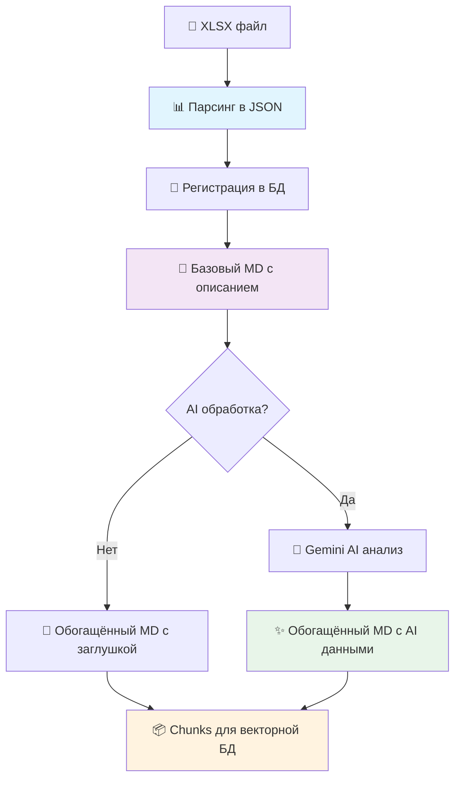

# 🚀 Анализатор тендерной документации

[](https://python.org)
[](https://fastapi.tiangolo.com/)
[](https://docs.celeryq.dev/)
[](https://ai.google.dev)
[](https://redis.io/)

## 📖 Описание

Асинхронная система для обработки и анализа тендерной документации с использованием **FastAPI + Celery + Redis + Google Gemini AI**.

Система обрабатывает XLSX файлы, извлекает структурированные данные и использует AI для классификации и анализа строительных позиций.

## ✨ Ключевые возможности

### 🏗️ **Архитектура**

- **FastAPI** - асинхронный REST API сервер
- **Celery** - фоновая обработка задач с очередями
- **Redis** - брокер сообщений и хранилище статусов
- **Модульная структура** - разделение воркеров по типам задач

### 🤖 **AI-анализ**

- **Google Gemini 1.5 Pro** - анализ и классификация позиций
- **Автоматическая категоризация** строительных работ
- **Извлечение технических параметров** из текста
- **NLP обработка** с использованием spaCy и русских моделей

### 🚀 **Функциональность**

- **Асинхронная загрузка** файлов через API
- **Отслеживание статуса** задач в реальном времени
- **Мониторинг воркеров** через Flower и API эндпоинты
- **Логирование** всех этапов обработки
- **Обработка ошибок** с retry механизмами

## 🏁 Быстрый старт

### 📦 Установка

```bash
# Клонирование репозитория
git clone https://github.com/zhukovvlad/parser_tender_xlsx.git
cd parser_tender_xlsx

# Создание виртуального окружения
python -m venv .venv
source .venv/bin/activate  # Linux/Mac

# Установка зависимостей
pip install -r requirements.txt

# Установка русской модели spaCy
python -m spacy download ru_core_news_sm

# Проверка Redis (должен быть установлен в системе)
redis-cli ping  # Должен вернуть PONG
```

### ⚙️ Настройка

Создайте файл `.env` в корне проекта:

```bash
# Google AI API
GOOGLE_API_KEY=your_gemini_api_key_here

# Go Backend Server
GO_SERVER_API_ENDPOINT=http://localhost:8080/api/v1
GO_SERVER_API_KEY=your_go_server_key_here  # опционально

# Redis настройки
REDIS_HOST=localhost
REDIS_PORT=6379
REDIS_URL=redis://localhost:6379/0

# Логирование
LOG_LEVEL=INFO
GEMINI_LOG_LEVEL=INFO

# TTL для статусов задач (в секундах)
STATUS_TTL_SECONDS=7200

# HTTP таймауты
GO_HTTP_TIMEOUT=60

# Режим отладки
SAVE_DEBUG_FILES=false
PARSER_FALLBACK_MODE=false
```

### 🚀 Запуск системы

#### Способ 1: Автоматический запуск всех сервисов

```bash
make start-all
```

Эта команда запустит:
- Redis (если не запущен)
- Celery Worker (фоновая обработка)
- Celery Beat (планировщик)
- FastAPI приложение (API сервер)

#### Способ 2: Ручной запуск компонентов

```bash
# Терминал 1: Celery Worker
celery -A app.celery_app worker --loglevel=INFO

# Терминал 2: Celery Beat (опционально)
celery -A app.celery_app beat --loglevel=INFO

# Терминал 3: FastAPI сервер
uvicorn main:app --host 0.0.0.0 --port 8000 --reload
```

#### Остановка сервисов

```bash
make stop-all
```

### 📤 Использование API

```bash
# Загрузка и парсинг файла (без AI)
curl -X POST "http://localhost:8000/parse-tender/" \
     -F "file=@tender.xlsx" \
     -F "enable_ai=false"

# Ответ:
{
  "task_id": "550e8400-e29b-41d4-a716-446655440000",
  "message": "Задача по обработке файла принята (без AI)",
  "enable_ai": false,
  "filename": "tender.xlsx"
}

# Загрузка с AI-анализом
curl -X POST "http://localhost:8000/parse-tender/" \
     -F "file=@tender.xlsx" \
     -F "enable_ai=true"

# Проверка статуса задачи
curl "http://localhost:8000/tasks/{task_id}/status"

# Ответ:
{
  "state": "SUCCESS",
  "status": "Task completed successfully",
  "result": {
    "tender_id": "123",
    "lots_processed": 2
  },
  "error": null
}

# Проверка здоровья системы
curl "http://localhost:8000/health"

# Статус Celery воркеров
curl "http://localhost:8000/celery-workers/status"
```

## 🏗️ Архитектура системы

### 📊 Пайплайн обработки



### 📁 Создаваемые файлы

Система создаёт несколько типов файлов на разных этапах обработки:

```text
📂 tenders_positions/          # Шаг 1: Детализированные позиции для AI
├── {tender_id}_{lot_id}_positions.md

📂 tenders_md_base/            # Шаг 2: Базовый MD из JSON
├── {tender_id}_{lot_id}_base.md

📂 tenders_md/                 # Шаг 3: Обогащённый MD с ключевыми параметрами
├── {tender_id}_{lot_id}.md

📂 tenders_chunks/             # Шаг 4: Chunks для векторной БД
└── {tender_id}_{lot_id}_chunks.json
```

### 🔄 Workflow обработки

1. **📤 Загрузка XLSX** → FastAPI принимает файл через `/parse-tender/`
2. **📊 Парсинг Excel** → Извлечение структурированных данных в JSON
3. **💾 Регистрация** → Отправка данных в Go-сервер, получение реальных DB ID
4. **📝 Создание positions** → Файлы с детализацией для AI обработки
5. **📄 Базовый MD** → Полное описание тендера в Markdown (из JSON)
6. **🤖 AI обработка** → Gemini анализирует позиции (опционально)
7. **🔧 Обогащённый MD** → MD с ключевыми параметрами + AI данными
8. **📦 Chunks** → Разбивка на смысловые части для векторной БД

### 🎯 Основной модуль: `parse_with_gemini.py`

Главная функция пайплайна - `parse_file_with_gemini()`:
- Оркестрирует весь процесс обработки
- Поддерживает синхронный и асинхронный режимы
- Интегрируется с Celery для фоновой обработки
- Создаёт все необходимые артефакты

### 📁 Структура проекта

```text
parser_tender_xlsx/
├── 🎯 main.py                     # FastAPI приложение
├── 📄 requirements.txt            # Python зависимости
├── 📄 Makefile                    # Команды для разработки
├── 📄 .env                        # Конфигурация
│
├── 📂 app/                        # Основная логика
│   ├── 📄 parse.py                # Excel парсер
│   ├── 📄 celery_app.py           # Конфигурация Celery
│   │
│   ├── 📂 gemini_module/          # AI обработка
│   │   ├── 📄 processor.py        # TenderProcessor класс
│   │   ├── 📄 constants.py        # Категории и конфигурации
│   │   └── 📄 config.py           # Настройки модели
│   │
│   └── 📂 workers/                # Celery воркеры
│       └── 📂 gemini/             # Gemini AI worker
│           ├── 📄 tasks.py        # Celery задачи
│           ├── 📄 worker.py       # Бизнес-логика AI
│           ├── 📄 manager.py      # Менеджер задач
│           └── 📄 integration.py  # API интеграция
│
├── 📂 scripts/                    # Управляющие скрипты
│   ├── 🔧 start_services.sh       # Запуск всей системы
│   └── 🔧 stop_services.sh        # Остановка системы
│
├── 📂 tenders_xlsx/               # Исходные файлы
├── 📂 tenders_positions/          # Обработанные позиции
├── 📂 pending_sync_positions/     # Файлы в fallback режиме
├── 📂 temp_uploads/               # Временные загрузки
└── 📂 logs/                       # Логи системы
```

## 🔧 Конфигурация

### 🔐 Переменные окружения (.env)

```bash
# Google AI API
GOOGLE_API_KEY=your_gemini_api_key_here

# Go Backend Server
GO_SERVER_API_ENDPOINT=http://localhost:8080/api/v1
GO_SERVER_API_KEY=your_go_server_key_here  # опционально

# Redis
REDIS_HOST=localhost
REDIS_PORT=6379
REDIS_URL=redis://localhost:6379/0

# Логирование
LOG_LEVEL=INFO
GEMINI_LOG_LEVEL=INFO

# TTL статусов (секунды)
STATUS_TTL_SECONDS=7200

# HTTP таймауты
GO_HTTP_TIMEOUT=60

# Режим отладки
SAVE_DEBUG_FILES=false
PARSER_FALLBACK_MODE=false
```

## 📋 Требования

### 🖥️ Системные требования

- **Python 3.12+** 
- **Redis** (должен быть установлен и запущен)
- **4GB+ RAM** для обработки больших файлов
- **SSD** рекомендуется для temp_uploads/

### 📦 Основные зависимости

```txt
# Web Framework
fastapi>=0.104.0             # Async REST API
uvicorn[standard]>=0.24.0    # ASGI сервер
python-multipart>=0.0.6      # Загрузка файлов

# Background Tasks
celery[redis]>=5.3.0         # Очередь задач
flower>=2.0.0                # Мониторинг Celery
redis>=5.0.0                 # Redis клиент

# AI & NLP
google-genai>=1.28.0         # Gemini AI
spacy>=3.8.0                 # NLP обработка
natasha>=1.6.0               # Русский NLP
pymorphy3>=2.0.3             # Морфология

# Data Processing
openpyxl>=3.1.2              # Excel файлы
pandas>=2.1.0                # Обработка данных
langchain-text-splitters>=0.3.9  # Разбивка текста на chunks
aiofiles>=25.1.0             # Async файловые операции

# Configuration
python-dotenv>=1.0.0         # .env файлы
pydantic>=2.0.0              # Валидация
pydantic-settings>=2.0.0     # Settings management
```


## 💻 Разработка

### 🛠️ Доступные команды (Makefile)

```bash
# Управление сервисами
make start-all         # Запуск всех сервисов
make stop-all          # Остановка всех сервисов

# Просмотр логов
make logs-worker       # Логи Celery worker
make logs-beat         # Логи Celery beat
make logs-all          # Все логи

# Мониторинг
make status            # Статус сервисов
make flower            # Запуск Flower (веб-мониторинг)

# Очистка
make clean             # Очистка временных файлов и кеша
```

### 📊 Мониторинг воркеров

```bash
# Просмотр логов в реальном времени
tail -f logs/celery_worker.log

# Celery inspect команды
celery -A app.celery_app inspect active
celery -A app.celery_app inspect registered
celery -A app.celery_app inspect stats

# Flower веб-интерфейс
celery -A app.celery_app flower --port=5555
# Открыть http://localhost:5555

# Проверка через API
curl http://localhost:8000/health
curl http://localhost:8000/celery-workers/status
```

### 🧪 Тестирование

```bash
# Запуск тестов
pytest app/tests/

# Тестирование с покрытием
pytest --cov=app --cov-report=html

# Тесты Excel парсера
pytest app/tests/excel_parser/

# Тесты Gemini модуля
pytest app/tests/gemini_module/
```

## 📚 Дополнительная информация

### 🔗 Полезные ссылки

- **FastAPI**: [https://fastapi.tiangolo.com/](https://fastapi.tiangolo.com/)
- **Celery**: [https://docs.celeryq.dev/](https://docs.celeryq.dev/)
- **Google Gemini AI**: [https://ai.google.dev/](https://ai.google.dev/)
- **Redis**: [https://redis.io/documentation](https://redis.io/documentation)
- **Flower**: [https://flower.readthedocs.io/](https://flower.readthedocs.io/)

### 🤝 Контакты

- **GitHub Issues**: [Сообщить о проблеме](https://github.com/zhukovvlad/parser_tender_xlsx/issues)
- **Документация**: См. файлы в `app/` и комментарии в коде

---

> **Примечание:** Этот проект находится в активной разработке. Функциональность может изменяться. Рекомендуется регулярно обновлять зависимости и следить за релизами.
