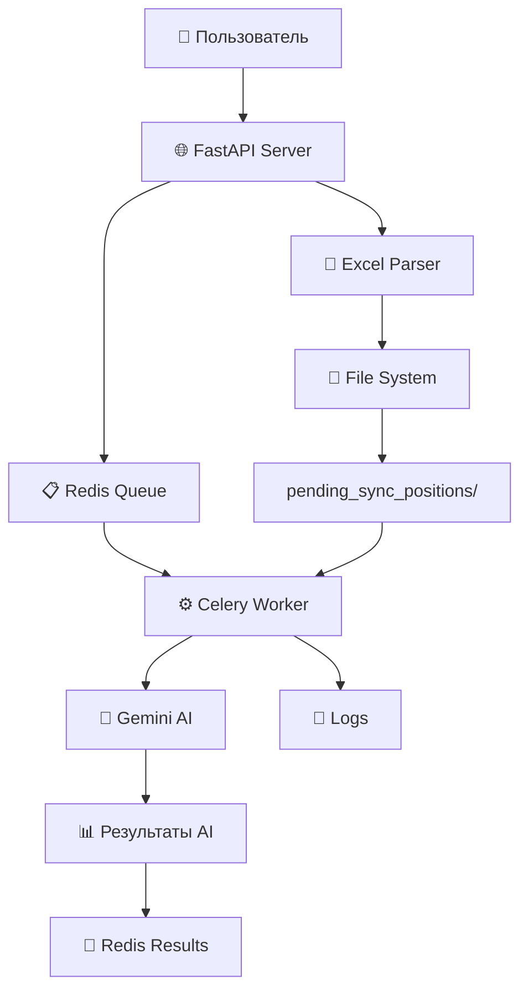
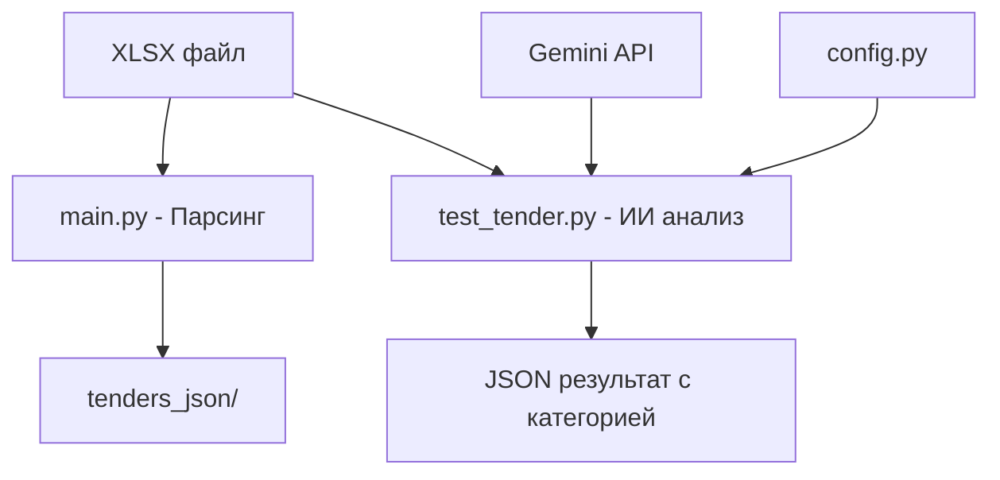

# 🚀 Интеллектуальный анализатор тендерной документации

[](https://python.org)
[](https://fastapi.tiangolo.com/)
[](https://docs.celeryq.dev/)
[](https://ai.google.dev)
[](https://redis.io/)
[](LICENSE)

## 📖 Описание

Профессиональная система для автоматизированного анализа тендерной документации с использованием современного стека технологий: **FastAPI + Celery + Redis + Google Gemini AI**. 

Система обеспечивает полный цикл обработки: от загрузки XLSX файлов до извлечения структурированных технических параметров с помощью искусственного интеллекта.

## ✨ Ключевые особенности

### 🏗️ **Микросервисная архитектура**
- **FastAPI** - современный асинхронный веб-фреймворк
- **Celery** - распределённая очередь задач для фоновой обработки  
- **Redis** - брокер сообщений и кеш результатов
- **Модульная структура** - легко масштабируемые воркеры

### 🤖 **AI-powered анализ**
- **Google Gemini 1.5 Pro** - передовая языковая модель
- **Автоматическая классификация** документов по типам работ
- **Структурированное извлечение** технических параметров
- **Специализация** на строительной отрасли

### 🚀 **Production-ready функции**
- **Асинхронная обработка** - неблокирующая загрузка файлов
- **Мониторинг задач** - отслеживание статуса обработки в реальном времени
- **Fallback режим** - автономная работа без внешних зависимостей
- **Retry механизмы** - устойчивость к временным сбоям
- **Comprehensive logging** - детальное логирование на всех уровнях

## 🏁 Быстрый старт

### 📦 Установка

```bash
# Клонирование репозитория
git clone https://github.com/zhukovvlad/parser_tender_xlsx.git
cd parser_tender_xlsx

# Создание виртуального окружения
python -m venv .venv
source .venv/bin/activate  # Linux/Mac
# или .venv\Scripts\activate  # Windows

# Установка зависимостей
pip install -r requirements.txt

# Установка и запуск Redis
sudo apt install redis-server  # Ubuntu/Debian
# или
brew install redis            # macOS
```

### ⚙️ Настройка

```bash
# Создайте .env файл с конфигурацией
cat > .env << EOF
# Google AI API
GOOGLE_API_KEY=your_gemini_api_key_here

# Логирование
LOG_LEVEL=INFO
GEMINI_LOG_LEVEL=DEBUG

# Режим работы (fallback без Go сервера)
PARSER_FALLBACK_MODE=true
GO_SERVER_API_ENDPOINT=http://localhost:8080/api/v1/import-tender
EOF
```

### 🚀 Запуск системы

```bash
# Способ 1: Автоматический запуск через скрипт
chmod +x scripts/start_services.sh
./scripts/start_services.sh

# Способ 2: Ручной запуск каждого компонента
# Терминал 1: Redis (если не запущен)
redis-server

# Терминал 2: Celery Worker
make celery-worker

# Терминал 3: FastAPI сервер
make fastapi-dev
```

### 📤 Использование API

```bash
# Загрузка и обработка файла
curl -X POST "http://localhost:8000/parse-tender-ai/" \
     -F "file=@тендер.xlsx" \
     -H "Content-Type: multipart/form-data"

# Ответ:
{
  "task_id": "abc123",
  "celery_task_id": "def456", 
  "message": "AI обработка запущена для 2 лотов",
  "lots_count": 2
}

# Проверка статуса обработки
curl "http://localhost:8000/celery-tasks/def456/status"

# Ответ:
{
  "state": "SUCCESS",
  "result": {
    "batch_result": {
      "successful_lots": 2,
      "total_lots": 2,
      "status": "completed"
    }
  }
}
```
## 🏗️ Архитектура системы

### 📊 Обзор компонентов



### 🔄 Workflow обработки

1. **📤 Загрузка файла** → FastAPI принимает `.xlsx` файл
2. **📊 Парсинг Excel** → Извлечение данных, создание `_positions.md` файлов  
3. **📋 Постановка в очередь** → Celery задачи отправляются в Redis
4. **🤖 AI обработка** → Gemini анализирует каждый лот параллельно
5. **📈 Мониторинг** → Отслеживание прогресса через API

### 📁 Структура проекта

```
parser_tender_xlsx/
├── 🎯 main.py                     # FastAPI приложение
├── 📄 requirements.txt            # Python зависимости  
├── 📄 Makefile                    # Команды для разработки
├── 📄 .env                        # Конфигурация
│
├── 📂 app/                        # Основная логика
│   ├── 📄 parse.py                # Excel парсер
│   ├── 📄 celery_app.py           # Конфигурация Celery
│   │
│   ├── 📂 gemini_module/          # AI обработка
│   │   ├── 📄 processor.py        # TenderProcessor класс
│   │   ├── 📄 constants.py        # Категории и конфигурации
│   │   └── 📄 config.py           # Настройки модели
│   │
│   └── 📂 workers/                # Celery воркеры
│       └── 📂 gemini/             # Gemini AI worker
│           ├── � tasks.py        # Celery задачи
│           ├── 📄 worker.py       # Бизнес-логика AI
│           ├── 📄 manager.py      # Менеджер задач
│           └── 📄 integration.py  # API интеграция
│
├── 📂 scripts/                    # Управляющие скрипты
│   ├── � start_services.sh       # Запуск всей системы
│   └── � stop_services.sh        # Остановка системы
│
├── 📂 tenders_xlsx/               # Исходные файлы
├── 📂 tenders_positions/          # Обработанные позиции
├── 📂 pending_sync_positions/     # Файлы в fallback режиме
├── 📂 temp_uploads/               # Временные загрузки
└── 📂 logs/                       # Логи системы
```

## � Использование

### � Загрузка и обработка тендеров

```bash
# Запуск полной системы
./scripts/start_services.sh

# Загрузка Excel файла через API
curl -X POST "http://localhost:8000/upload-excel/" \
     -H "accept: application/json" \
     -H "Content-Type: multipart/form-data" \
     -F "file=@tender_file.xlsx"

# Запуск AI обработки
curl -X POST "http://localhost:8000/parse-tender-ai/"

# Проверка статуса задачи  
curl "http://localhost:8000/celery-tasks/{task_id}/status"
```

### 🔍 Мониторинг и управление

```bash
# Просмотр активных задач Celery
curl "http://localhost:8000/celery-tasks/"

# Просмотр логов Gemini AI
tail -f logs/gemini.log

# Остановка всех сервисов
./scripts/stop_services.sh
```

### ⚙️ Конфигурация AI обработки

Система автоматически классифицирует тендерные лоты и извлекает ключевые параметры:

**🏗️ Поддерживаемые категории:**
- `earth_works` - Земляные работы (котлованы, траншеи)
- `pile_works` - Свайные работы (буронабивные, забивные сваи)
- `concrete_works` - Бетонные работы (фундаменты, конструкции)
- `road_works` - Дорожные работы (асфальт, покрытия)
- `other` - Прочие строительные работы

**📊 Извлекаемые параметры:**
- `pit_volume_m3` - Объем котлована (м³)
- `slurry_wall_specs` - Технические характеристики стен в грунте
- `strut_system_weights_t` - Вес системы распорок (т)
- `main_pile_specs` - Основные характеристики свай
```

## 🔄 Workflow обработки

### 1. 📊 Парсинг XLSX файлов

**Через FastAPI API:**
```bash
# Загрузка Excel файла
curl -X POST "http://localhost:8000/upload-excel/" \
     -F "file=@tender_file.xlsx"
```

**Процесс:**
1. **Парсинг XLSX** - извлечение строительных лотов из исходного файла
2. **Постобработка** - нормализация структуры, очистка данных
3. **Регистрация в БД** - отправка данных на Go-сервер для получения уникальных ID
4. **Генерация артефактов** - создание JSON и Markdown файлов по лотам
5. **Архивация** - перемещение файлов в соответствующие директории

### 2. 🤖 AI анализ через Celery

**Запуск фоновой обработки:**
```bash
curl -X POST "http://localhost:8000/parse-tender-ai/"
```

**Процесс:**
1. **Сканирование файлов** - поиск новых `_positions.md` файлов
2. **Постановка в очередь** - создание Celery задач для каждого лота
3. **Parallel AI обработка** - Gemini анализирует лоты параллельно
4. **Классификация и извлечение** - определение категории + структурированные данные
5. **Сохранение результатов** - обновление файлов с AI анализом

### 3. 📈 Мониторинг задач

```bash
# Статус конкретной задачи
curl "http://localhost:8000/celery-tasks/{task_id}/status"

# Все активные задачи
curl "http://localhost:8000/celery-tasks/"
```

## ⚙️ Конфигурация

### 🤖 Gemini AI модель

```python
# app/gemini_module/config.py
MODEL_CONFIG = {
    "default_model": "models/gemini-1.5-pro",
    "temperature": 0.1,
    "max_tokens": 8192,
    "top_p": 0.8,
    "top_k": 10
}
```

### 🔧 Celery настройки

```python
# app/celery_app.py
broker_url = 'redis://localhost:6379/0'      # Redis очередь
result_backend = 'redis://localhost:6379/0'  # Хранение результатов
task_routes = {
    'app.workers.gemini.tasks.*': {'queue': 'celery'}
}
```

### 🌍 Переменные окружения

```bash
# .env файл
GOOGLE_API_KEY=your_gemini_api_key_here
REDIS_URL=redis://localhost:6379/0
SERVER_URL=http://your-go-server:8080  # Опционально
```

## 📁 Структура данных

### 📂 Выходные директории

```
tenders_xlsx/           # ✅ Исходные XLSX файлы (с ID из БД)
tenders_json/           # 📄 JSON файлы с данными лотов
tenders_md/             # 📝 Markdown отчеты по тендерам
tenders_chunks/         # 🧩 Чанки для RAG-систем
tenders_positions/      # 📊 Детализированные отчеты по позициям + AI анализ

# Fallback режим (при недоступности Go-сервера):
pending_sync/           # 🔄 Файлы ожидающие синхронизации
├── xlsx/              # Временные XLSX файлы
├── json/              # Временные JSON файлы  
├── md/                # Временные MD файлы
├── chunks/            # Временные чанки
└── positions/         # Временные отчеты по позициям

# AI обработка:
pending_sync_positions/ # 🤖 Позиции ожидающие AI анализа
```

### 📊 Формат AI результатов

```json
{
  "tender_id": "168",
  "lot_number": "1", 
  "category": "earth_works",
  "confidence_score": 0.95,
  "extracted_parameters": {
    "pit_volume_m3": 15000,
    "slurry_wall_specs": "Стена в грунте толщиной 0.8м",
    "strut_system_weights_t": 145.5,
    "main_pile_specs": "Буронабивные сваи D=1200мм L=25м"
  },
  "processing_metadata": {
    "processed_at": "2024-01-15T10:30:00Z",
    "processing_duration": 2.4,
    "model_version": "gemini-1.5-pro"
  }
}
```

## 📋 Требования

### 🖥️ Системные требования

- **Python 3.12+** (рекомендуется для лучшей производительности)
- **Redis 7.0+** (для Celery очередей и кэширования результатов)
- **Go-сервер** (опционально, для интеграции с основной БД)

### 📦 Ключевые зависимости

```txt
# Web Framework & API
fastapi==0.115.6              # Современный async web framework
uvicorn[standard]==0.34.0     # ASGI сервер

# Background Tasks
celery==5.5.3                 # Распределенная очередь задач
redis==5.2.1                  # Redis клиент для брокера

# AI & Processing  
google-generativeai==0.8.3    # Gemini AI интеграция
openpyxl==3.1.5               # Excel файлы обработка

# Configuration & Utils
python-dotenv==1.0.1          # Переменные окружения
pydantic==2.10.3              # Валидация данных
```

## 🚀 Быстрый старт

### 1. 📥 Клонирование и настройка

```bash
# Клонирование репозитория
git clone https://github.com/zhukovvlad/parser_tender_xlsx.git
cd parser_tender_xlsx

# Создание виртуального окружения  
python -m venv venv
source venv/bin/activate  # Linux/macOS
# venv\Scripts\activate   # Windows

# Установка зависимостей
pip install -r requirements.txt
```

### 2. ⚙️ Настройка окружения

```bash
# Копирование шаблона конфигурации
cp .env.example .env

# Редактирование конфигурации
nano .env
```

```bash
# .env файл
GOOGLE_API_KEY=your_gemini_api_key_here
REDIS_URL=redis://localhost:6379/0
SERVER_URL=http://localhost:8080  # Опционально
```

### 3. 🔧 Установка Redis

```bash
# Ubuntu/Debian
sudo apt update && sudo apt install redis-server

# macOS (с Homebrew)
brew install redis

# Запуск Redis
sudo systemctl start redis-server  # Linux
brew services start redis          # macOS
```

### 4. 🏃‍♂️ Запуск системы

```bash
# Запуск всех сервисов одной командой
./scripts/start_services.sh

# Или вручную:
# 1. Запуск FastAPI сервера
uvicorn main:app --reload --port 8000

# 2. Запуск Celery worker (в отдельном терминале)
celery -A app.celery_app worker --loglevel=info

# 3. Запуск Celery beat для периодических задач (опционально)
celery -A app.celery_app beat --loglevel=info
```
   make install
   # или
## 💻 Разработка

### 🛠️ Команды разработчика

```bash
# Makefile команды
make install    # Установка зависимостей
make dev        # Запуск в режиме разработки
make test       # Запуск тестов
make lint       # Проверка кода
make clean      # Очистка кэша и временных файлов

# Celery управление
make celery-worker    # Запуск Celery worker
make celery-beat      # Запуск Celery beat scheduler
make celery-monitor   # Мониторинг Celery задач
```

### 🧪 Тестирование

```bash
# Запуск всех тестов
python -m pytest app/tests/

# Тестирование с покрытием
python -m pytest --cov=app --cov-report=html

# Тестирование конкретного модуля
python -m pytest app/tests/test_gemini_worker.py -v
```

### � Мониторинг

```bash
# Просмотр логов Gemini AI
tail -f logs/gemini.log

# Мониторинг Redis
redis-cli monitor

# Celery flower (веб-интерфейс для мониторинга)
pip install flower
celery -A app.celery_app flower
# http://localhost:5555
```
# Анализ документа с помощью Gemini AI
python test_tender.py path/to/document.xlsx

# Или использовать современную версию напрямую
## � Устранение неполадок

### ❌ Распространенные проблемы

#### Redis не запускается
```bash
# Проверка статуса Redis
sudo systemctl status redis-server

# Перезапуск Redis
sudo systemctl restart redis-server

# Проверка соединения
redis-cli ping
# Ожидаемый ответ: PONG
```

#### Celery worker не видит задачи
```bash
# Проверка очередей Redis
redis-cli
> KEYS celery*

# Перезапуск Celery worker
pkill -f celery
celery -A app.celery_app worker --loglevel=info
```

#### Gemini API ошибки
```bash
# Проверка API ключа
echo $GOOGLE_API_KEY

# Проверка квот в Google AI Studio
# https://aistudio.google.com/app/apikey

# Просмотр логов Gemini
tail -f logs/gemini.log
```

#### Проблемы с XLSX файлами
```bash
# Проверка формата файла
file your_file.xlsx

# Проверка кодировки содержимого
python -c "import openpyxl; wb=openpyxl.load_workbook('file.xlsx'); print(wb.sheetnames)"
```

### 📋 Проверочный список перед запуском

- [ ] ✅ Python 3.12+ установлен
- [ ] ✅ Redis сервер запущен и доступен
- [ ] ✅ Файл `.env` создан с `GOOGLE_API_KEY`  
- [ ] ✅ Виртуальное окружение активировано
- [ ] ✅ Все зависимости установлены (`pip install -r requirements.txt`)
- [ ] ✅ Порт 8000 свободен для FastAPI
- [ ] ✅ Директории `tenders_positions/` и `pending_sync_positions/` существуют

```bash
# Показать все доступные команды
make help

# Установка зависимостей
make install

# Парсинг XLSX файла
make parse FILE=path/to/tender.xlsx

# ИИ-анализ документа
## 📚 Дополнительная информация

### 🔗 Полезные ссылки

- **FastAPI документация**: [https://fastapi.tiangolo.com/](https://fastapi.tiangolo.com/)
- **Celery документация**: [https://docs.celeryq.dev/](https://docs.celeryq.dev/)
- **Google Gemini AI**: [https://ai.google.dev/](https://ai.google.dev/)
- **Redis документация**: [https://redis.io/documentation](https://redis.io/documentation)

### 📈 Производительность

- **Parallel processing**: До 10 лотов обрабатываются одновременно
- **Smart caching**: Redis кэширует результаты AI анализа
- **Batch optimization**: Группировка мелких задач для эффективности
- **Memory management**: Автоматическая очистка больших объектов

### 🔒 Безопасность

- **API Key protection**: Переменные окружения не сохраняются в коде
- **Input validation**: Проверка загружаемых файлов
- **Error handling**: Graceful degradation при недоступности сервисов
- **Logging**: Детальные логи без чувствительных данных

### 📞 Поддержка

При возникновении проблем:

1. **Проверьте логи**: `tail -f logs/gemini.log`
2. **Проверьте Celery статус**: `celery -A app.celery_app status`  
3. **Проверьте Redis**: `redis-cli ping`
4. **Создайте issue**: [GitHub Issues](https://github.com/zhukovvlad/parser_tender_xlsx/issues)

---

*Система разработана для автоматизации анализа строительных тендеров с использованием современных AI технологий и микросервисной архитектуры.*
```

#### 2. ИИ-анализ с Gemini

```bash
# Анализ одного документа
python test_tender.py ./temp_uploads/document.xlsx

# Интерактивный режим
python test_tender.py
# Введите путь к файлу: ./temp_uploads/document.xlsx
```

### 🎯 Режимы работы

| Режим         | Описание                              | Команда                           |
| ------------- | ------------------------------------- | --------------------------------- |
| **Парсинг**   | Извлечение данных из XLSX             | `python main.py file.xlsx`        |
| **ИИ-анализ** | Классификация и извлечение параметров | `python test_tender.py file.xlsx` |
| **Комбо**     | Парсинг + ИИ-анализ в одном флоу      | `make process FILE=file.xlsx`     |

## 📊 Формат выходных данных

### 📊 Результат парсинга XLSX (`main.py`)

```
tenders_xlsx/12345.xlsx                    # Исходный файл (с DB ID)
tenders_json/12345.json                    # Основные данные тендера
tenders_md/12345.md                        # Markdown отчет
tenders_positions/12345_67890_positions.md # Детализированный отчет по лоту
tenders_chunks/12345_chunks.json           # Чанки для RAG-систем
```

### 🤖 Результат ИИ-анализа (`test_tender.py`)

```json
{
  "status": "✅ success",
  "file_info": {
    "name": "котлован_проект.xlsx",
    "size": "2.1 MB",
    "processing_time": "12.3s"
  },
  "classification": {
    "category": "🏗️ Котлованы и траншеи",
    "confidence": 0.92,
    "reasoning": "Обнаружены работы по устройству котлована глубиной 4.2м"
  },
  "extracted_data": {
    "volume": "2850 м³",
    "depth": "4.2 м",
    "soil_type": "суглинок",
    "equipment": "экскаватор обратная лопата"
  },
  "categories_detected": ["Котлованы и траншеи", "Земляные работы"]
}
```

### 📂 Структура проекта после обработки

```
📁 parser/
├── 📄 temp_uploads/document.xlsx          # 📥 Входящий файл
├── 📂 tenders_xlsx/12345.xlsx            # 📊 Исходник с DB ID
├── 📂 tenders_json/12345.json            # 📄 Структурированные данные
├── 📂 logs/parser.log                    # 📊 Логи обработки
└── 📂 tenders_positions/                 # 📋 Детализированные отчеты
    └── 12345_67890_positions.md
```

## 🏗️ Архитектурные особенности

### 🤖 ИИ-powered анализ

- **Gemini 2.5 Pro**: Передовая модель для анализа документов
- **Автоклассификация**: Умное определение категории лота
- **Извлечение параметров**: Структурированное извлечение технических данных
- **Контекстное понимание**: Понимание специфики строительной отрасли

### 🔧 Современная архитектура

- **OOP подход**: Класс `TenderAnalyzer` для инкапсуляции логики
- **Централизованная конфигурация**: Единый `config.py` для всех настроек
- **Robust error handling**: Обработка ошибок и fallback стратегии
- **Логирование**: Подробные логи для отладки и мониторинга

### 📊 Database-First подход (main.py)

- **Регистрация прежде всего**: Тендер сначала регистрируется в БД
- **Уникальные ID**: Все файлы именуются по ID из БД
- **Трассируемость**: Прямая связь между файлами и записями в БД
- **Fail-fast**: При неудачной регистрации обработка прерывается

### 🔄 Интеграция компонентов



### 🌐 Внешние интеграции

- **Go-сервер API**: Регистрация тендеров и получение ID
- **Gemini API**: Анализ документов через Google AI
- **RAG-системы**: Генерация чанков для поиска## Интеграция с внешними системами

### Go-сервер API

```bash
# Настройка в .env
GO_SERVER_API_ENDPOINT=http://localhost:8080/api/tenders
GO_SERVER_API_KEY=your_api_key_here
```

**Ожидаемый формат ответа:**

```json
{
  "success": true,
  "db_id": "12345",
  "lots_id": {
    "LOT_1": 67890,
    "LOT_2": 67891
  }
}
```

### RAG-системы

Генерируемые чанки (`{id}_chunks.json`) готовы для использования в RAG-системах:

```json
[
  {
    "chunk_id": "chunk_1",
    "text": "Содержимое чанка для поиска",
    "metadata": {
      "tender_id": "12345",
      "chunk_type": "lot_description"
    }
  }
]
```

## 🔧 Устранение неполадок

### 🔌 Проблемы с Gemini API

```bash
# Проверка API ключа
echo $GEMINI_API_KEY

# Тест подключения
python -c "import google.generativeai as genai; genai.configure(api_key='$GEMINI_API_KEY'); print('✅ API работает')"

# Проверка логов
tail -f logs/parser.log
```

### 📦 Проблемы с зависимостями

```bash
# Переустановка в чистом окружении
rm -rf .venv
python -m venv .venv
source .venv/bin/activate
pip install -r requirements.txt

# Проверка версий
python --version  # Должна быть >= 3.12
pip list
```

### 📁 Проблемы с файлами

```bash
# Проверка структуры
ls -la temp_uploads/
ls -la tenders_*/

# Права доступа
chmod 755 temp_uploads/
chmod 644 temp_uploads/*.xlsx

# Очистка
make clean
```

## ⚡ Производительность

### 📊 Рекомендации

- **SSD диски**: Используйте SSD для `temp_uploads/` и `logs/`
- **Память**: Минимум 4GB RAM для больших файлов
- **API лимиты**: Gemini имеет лимиты на количество запросов/минуту
- **Размер файлов**: Оптимально до 50MB на файл

### 🎯 Мониторинг

```bash
# Мониторинг обработки
watch -n 5 'ls -la temp_uploads/ | wc -l'

# Размер логов
du -h logs/

# Производительность
time python test_tender.py document.xlsx
```

## 🚀 Roadmap

### v2.0 планы

- [ ] 🔄 **Async/await**: Асинхронная обработка
- [ ] 🧪 **Batch режим**: Обработка нескольких файлов за раз
- [ ] 📊 **Metrics**: Подробная аналитика работы
- [ ] 🌐 **Web UI**: Веб-интерфейс для загрузки и анализа
- [ ] 🔍 **Поиск**: Полнотекстовый поиск по результатам

### v1.x улучшения

- [ ] ✅ **Unit тесты**: Покрытие тестами
- [ ] 📝 **Type hints**: Полная типизация
- [ ] 🛡️ **Security**: Валидация загружаемых файлов
- [ ] 🏗️ **Docker**: Контейнеризация

## 📄 Лицензия

Проект распространяется под лицензией **MIT**. Подробности в [LICENSE](LICENSE).

## 🤝 Поддержка

- 📧 **Email**: zhukovvlad@example.com
- 🐛 **Issues**: [GitHub Issues](https://github.com/zhukovvlad/parser_tender_xlsx/issues)
- 📖 **Docs**: [Wiki](https://github.com/zhukovvlad/parser_tender_xlsx/wiki)

---

<div align="center">

**Сделано с ❤️ для автоматизации анализа тендерной документации**

_Powered by Google Gemini 2.5 Pro_ 🤖

</div>
- 🐛 **Issues:** [GitHub Issues](https://github.com/zhukovvlad/parser_tender_xlsx/issues)
- 📖 **Wiki:** [Project Wiki](https://github.com/zhukovvlad/parser_tender_xlsx/wiki)
- 📋 **Changelog:** [CHANGELOG.md](CHANGELOG.md)

---

> **Примечание:** Этот проект находится в активной разработке. Функциональность может изменяться. Рекомендуется регулярно обновлять зависимости и следить за релизами.
