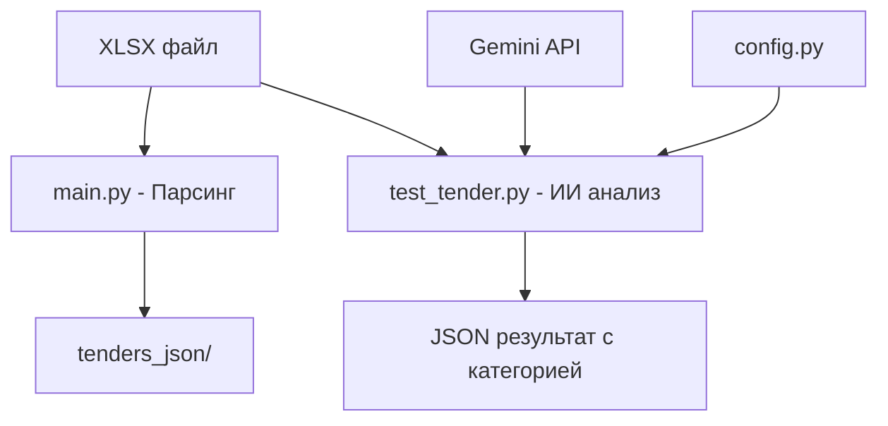

# 🚀 Парсер и анализатор тендерной документации с Gemini AI

[](https://python.org)
[](https://ai.google.dev)
[](LICENSE)

## 📖 Описание

Современный комплексный пайплайн на Python для интеллектуального анализа тендерной документации с использованием Google Gemini AI. Проект автоматизирует извлечение данных из Excel-файлов (XLSX), их смысловую обработку, категоризацию лотов и извлечение ключевых технических параметров.

## ✨ Ключевые особенности

- 🤖 **Gemini 2.5 Pro интеграция** - использование последней версии модели Google
- 🏗️ **Современная архитектура** - ООП подход с классом `TenderAnalyzer`
- 🔧 **Централизованная конфигурация** - все настройки в едином модуле
- � **Профессиональное логирование** - детальные логи с уровнями и эмодзи
- 🛡️ **Расширенная обработка ошибок** - типизированные исключения и graceful recovery
- � **Гибкое сохранение** - результаты в консоль и/или файл по выбору
- 📊 **Валидация данных** - проверка файлов и входных параметров
- 🎯 **CLI интерфейс** - удобные аргументы командной строки

## 🚀 Быстрый старт

### Установка

```bash
# Клонирование репозитория
git clone https://github.com/zhukovvlad/parser_tender_xlsx.git
cd parser_tender_xlsx

# Создание виртуального окружения
python -m venv .venv
source .venv/bin/activate  # Linux/Mac
# или .venv\Scripts\activate  # Windows

# Установка зависимостей
pip install -r requirements.txt
```

### Настройка

```bash
# Создайте .env файл на основе примера
cp .env.example .env

# Добавьте ваш API ключ Gemini
echo "GOOGLE_API_KEY=your_api_key_here" >> .env
```

### Использование

```bash
# Анализ файла по умолчанию
python test_tender.py

# Анализ конкретного файла
python test_tender.py document.md

# Анализ с сохранением в файл
python test_tender.py --output results.json

# Подробный режим с детальными логами
python test_tender.py --verbose

# Все опции вместе
python test_tender.py mydoc.md --output analysis.json --verbose
```

## 📁 Структура проекта

```
parser_tender_xlsx/
├── 📄 test_tender.py              # 🎯 Основной скрипт (symlink на refactored)
├── 📄 _test_tender_refactored.py  # ✨ Новая версия с современной архитектурой
├── 📄 _test_tender.py             # ⚠️  Устаревшая версия (deprecated)
├── 📄 main.py                     # 🔧 Парсер XLSX файлов
├── 📄 requirements.txt            # 📦 Зависимости Python
├── 📄 pyproject.toml             # ⚙️  Конфигурация проекта
│
├── 📂 app/                       # 🏗️ Основная логика приложения
│   ├── 📂 gemini_module/         # 🤖 Модуль работы с Gemini AI
│   │   ├── config.py             # ⚙️  Централизованная конфигурация
│   │   ├── constants.py          # 📊 Константы и шаблоны категорий
│   │   └── processor.py          # 🔄 Класс TenderProcessor
│   │
│   ├── 📂 helpers/               # 🛠️ Вспомогательные функции
│   ├── 📂 markdown_utils/        # 📝 Утилиты для Markdown
│   ├── 📂 json_to_server/        # 🌐 Отправка данных на сервер
│   └── 📂 tests/                 # 🧪 Тесты
│
├── 📂 tenders_xlsx/              # 📊 Исходные XLSX файлы
├── 📂 tenders_json/              # 📄 Обработанные JSON файлы
├── 📂 logs/                      # 📊 Файлы логов
└── 📂 temp_uploads/              # 🗂️ Временные файлы
```

## 🔄 Процесс обработки данных

### 1. 📊 Парсинг XLSX файлов (`main.py`)

1. **Парсинг XLSX** - извлечение данных из исходного файла
2. **Постобработка** - нормализация структуры, очистка данных
3. **Регистрация в БД** - отправка данных на Go-сервер для получения уникальных ID
4. **Генерация артефактов** - создание JSON и Markdown файлов
5. **Архивация** - перемещение всех файлов в соответствующие директории

### 2. 🤖 ИИ-анализ документов (`test_tender.py`)

1. **Загрузка файла** - валидация и отправка на Gemini API
2. **Классификация** - автоматическое определение категории лота
3. **Извлечение параметров** - структурированное извлечение технических данных
4. **Вывод результатов** - JSON с метаданными и анализом
5. **Очистка ресурсов** - автоматическое удаление временных файлов

## 🏗️ Архитектура

### Класс TenderAnalyzer

```python
class TenderAnalyzer:
    def __init__(self, api_key: str)          # Инициализация с API ключом
    def analyze_document(self, file: Path)     # Полный анализ документа
    def _classify_document(self) -> str        # Классификация по категориям
    def _extract_data(self, category: str)     # Извлечение данных
    def _cleanup(self)                         # Очистка ресурсов
```

### Конфигурация

```python
# app/gemini_module/config.py
MODEL_CONFIG = {
    "default_model": "models/gemini-2.5-pro",
    "temperature": 0.1,
    "max_tokens": 8192,
}
```

### Выходные директории

```
tenders_xlsx/           # Исходные XLSX файлы (переименованы с DB ID)
tenders_json/           # JSON файлы с данными
tenders_md/             # Markdown отчеты
tenders_chunks/         # Чанки для RAG-систем
tenders_positions/      # Детализированные отчеты по позициям
pending_sync/           # Файлы в режиме offline (при недоступности сервера)
├── xlsx/              # Временные XLSX файлы
├── json/              # Временные JSON файлы
├── md/                # Временные MD файлы
├── chunks/            # Временные чанки
└── positions/         # Временные отчеты по позициям
```

## Требования

- Python 3.9+ (рекомендуется 3.12+)
- Go-сервер для регистрации тендеров (опционально с резервным режимом)
- Все необходимые библиотеки перечислены в `requirements.txt`

### Ключевые зависимости

- `openpyxl` - работа с Excel файлами
- `requests` - HTTP запросы к серверу
- `python-dotenv` - управление переменными окружения
- `pathlib` - работа с путями файлов

## Установка

1. **Клонируйте репозиторий:**

   ```bash
   git clone https://github.com/zhukovvlad/parser_tender_xlsx.git
   cd parser_tender_xlsx
   ```

2. **Создайте и активируйте виртуальное окружение:**

   ```bash
   python -m venv venv
   # Linux/macOS:
   source venv/bin/activate
   # Windows:
   venv\Scripts\activate
   ```

3. **Установите зависимости:**

   ```bash
   make install
   # или
   pip install -r requirements.txt
   ```

4. **Настройте переменные окружения:**
   ```bash
   cp .env.example .env
   # Отредактируйте .env файл под ваши настройки
   ```

### Пример конфигурации (.env)

```env
# Основные настройки
GO_SERVER_API_ENDPOINT=http://localhost:8080/api/tenders
GO_SERVER_API_KEY=your_api_key_here

# Резервный режим (для работы без сервера)
PARSER_FALLBACK_MODE=false

# Настройки LLM (для llm_test.py)
OLLAMA_URL=http://localhost:11434/api/chat
OLLAMA_MODEL=mistral
OLLAMA_TOKEN=
```

## 🚀 Использование

### 📊 Парсинг XLSX файлов

```bash
# Парсинг одного файла
python main.py path/to/tender.xlsx

# Парсинг всех файлов в директории
python main.py path/to/directory/
```

### 🤖 ИИ-анализ документов

```bash
# Анализ документа с помощью Gemini AI
python test_tender.py path/to/document.xlsx

# Или использовать современную версию напрямую
python _test_tender_refactored.py path/to/document.xlsx
```

### 📄 Пример вывода ИИ-анализа

```json
{
  "status": "success",
  "file_info": {
    "name": "tender_example.xlsx",
    "size": "2.5 MB",
    "upload_time": "2024-01-15T10:30:00Z"
  },
  "analysis": {
    "category": "Котлованы и траншеи",
    "confidence": 0.95,
    "detected_parameters": {
      "volume": "1500 м³",
      "depth": "3.5 м",
      "soil_type": "глина",
      "equipment": "экскаватор"
    }
  },
  "processing_time": "15.2s"
}
```

### ⚙️ Конфигурация

Создайте `.env` файл с настройками:

```bash
# Обязательные настройки
GEMINI_API_KEY=your_api_key_here

# Опциональные настройки
LOG_LEVEL=INFO
DEBUG_MODE=False
```

### 📊 Быстрый старт с Makefile

```bash
# Показать все доступные команды
make help

# Установка зависимостей
make install

# Парсинг XLSX файла
make parse FILE=path/to/tender.xlsx

# ИИ-анализ документа
make ai-analyze FILE=path/to/document.xlsx

# Запуск тестов
make test

# Очистка временных файлов
make clean
```

### 🔧 Детальное использование

#### 1. Парсинг XLSX файлов

```bash
# Парсинг одного файла
python main.py ./tenders_xlsx/example.xlsx

# Парсинг всех файлов в директории
for file in ./tenders_xlsx/*.xlsx; do
    python main.py "$file"
done
```

#### 2. ИИ-анализ с Gemini

```bash
# Анализ одного документа
python test_tender.py ./temp_uploads/document.xlsx

# Интерактивный режим
python test_tender.py
# Введите путь к файлу: ./temp_uploads/document.xlsx
```

### 🎯 Режимы работы

| Режим         | Описание                              | Команда                           |
| ------------- | ------------------------------------- | --------------------------------- |
| **Парсинг**   | Извлечение данных из XLSX             | `python main.py file.xlsx`        |
| **ИИ-анализ** | Классификация и извлечение параметров | `python test_tender.py file.xlsx` |
| **Комбо**     | Парсинг + ИИ-анализ в одном флоу      | `make process FILE=file.xlsx`     |

## 📊 Формат выходных данных

### 📊 Результат парсинга XLSX (`main.py`)

```
tenders_xlsx/12345.xlsx                    # Исходный файл (с DB ID)
tenders_json/12345.json                    # Основные данные тендера
tenders_md/12345.md                        # Markdown отчет
tenders_positions/12345_67890_positions.md # Детализированный отчет по лоту
tenders_chunks/12345_chunks.json           # Чанки для RAG-систем
```

### 🤖 Результат ИИ-анализа (`test_tender.py`)

```json
{
  "status": "✅ success",
  "file_info": {
    "name": "котлован_проект.xlsx",
    "size": "2.1 MB",
    "processing_time": "12.3s"
  },
  "classification": {
    "category": "🏗️ Котлованы и траншеи",
    "confidence": 0.92,
    "reasoning": "Обнаружены работы по устройству котлована глубиной 4.2м"
  },
  "extracted_data": {
    "volume": "2850 м³",
    "depth": "4.2 м",
    "soil_type": "суглинок",
    "equipment": "экскаватор обратная лопата"
  },
  "categories_detected": ["Котлованы и траншеи", "Земляные работы"]
}
```

### 📂 Структура проекта после обработки

```
📁 parser/
├── 📄 temp_uploads/document.xlsx          # 📥 Входящий файл
├── 📂 tenders_xlsx/12345.xlsx            # 📊 Исходник с DB ID
├── 📂 tenders_json/12345.json            # 📄 Структурированные данные
├── 📂 logs/parser.log                    # 📊 Логи обработки
└── 📂 tenders_positions/                 # 📋 Детализированные отчеты
    └── 12345_67890_positions.md
```

## 🏗️ Архитектурные особенности

### 🤖 ИИ-powered анализ

- **Gemini 2.5 Pro**: Передовая модель для анализа документов
- **Автоклассификация**: Умное определение категории лота
- **Извлечение параметров**: Структурированное извлечение технических данных
- **Контекстное понимание**: Понимание специфики строительной отрасли

### 🔧 Современная архитектура

- **OOP подход**: Класс `TenderAnalyzer` для инкапсуляции логики
- **Централизованная конфигурация**: Единый `config.py` для всех настроек
- **Robust error handling**: Обработка ошибок и fallback стратегии
- **Логирование**: Подробные логи для отладки и мониторинга

### 📊 Database-First подход (main.py)

- **Регистрация прежде всего**: Тендер сначала регистрируется в БД
- **Уникальные ID**: Все файлы именуются по ID из БД
- **Трассируемость**: Прямая связь между файлами и записями в БД
- **Fail-fast**: При неудачной регистрации обработка прерывается

### 🔄 Интеграция компонентов



### 🌐 Внешние интеграции

- **Go-сервер API**: Регистрация тендеров и получение ID
- **Gemini API**: Анализ документов через Google AI
- **RAG-системы**: Генерация чанков для поиска## Интеграция с внешними системами

### Go-сервер API

```bash
# Настройка в .env
GO_SERVER_API_ENDPOINT=http://localhost:8080/api/tenders
GO_SERVER_API_KEY=your_api_key_here
```

**Ожидаемый формат ответа:**

```json
{
  "success": true,
  "db_id": "12345",
  "lots_id": {
    "LOT_1": 67890,
    "LOT_2": 67891
  }
}
```

### RAG-системы

Генерируемые чанки (`{id}_chunks.json`) готовы для использования в RAG-системах:

```json
[
  {
    "chunk_id": "chunk_1",
    "text": "Содержимое чанка для поиска",
    "metadata": {
      "tender_id": "12345",
      "chunk_type": "lot_description"
    }
  }
]
```

## 🔧 Устранение неполадок

### 🔌 Проблемы с Gemini API

```bash
# Проверка API ключа
echo $GEMINI_API_KEY

# Тест подключения
python -c "import google.generativeai as genai; genai.configure(api_key='$GEMINI_API_KEY'); print('✅ API работает')"

# Проверка логов
tail -f logs/parser.log
```

### 📦 Проблемы с зависимостями

```bash
# Переустановка в чистом окружении
rm -rf .venv
python -m venv .venv
source .venv/bin/activate
pip install -r requirements.txt

# Проверка версий
python --version  # Должна быть >= 3.12
pip list
```

### 📁 Проблемы с файлами

```bash
# Проверка структуры
ls -la temp_uploads/
ls -la tenders_*/

# Права доступа
chmod 755 temp_uploads/
chmod 644 temp_uploads/*.xlsx

# Очистка
make clean
```

## ⚡ Производительность

### 📊 Рекомендации

- **SSD диски**: Используйте SSD для `temp_uploads/` и `logs/`
- **Память**: Минимум 4GB RAM для больших файлов
- **API лимиты**: Gemini имеет лимиты на количество запросов/минуту
- **Размер файлов**: Оптимально до 50MB на файл

### 🎯 Мониторинг

```bash
# Мониторинг обработки
watch -n 5 'ls -la temp_uploads/ | wc -l'

# Размер логов
du -h logs/

# Производительность
time python test_tender.py document.xlsx
```

## 🚀 Roadmap

### v2.0 планы

- [ ] 🔄 **Async/await**: Асинхронная обработка
- [ ] 🧪 **Batch режим**: Обработка нескольких файлов за раз
- [ ] 📊 **Metrics**: Подробная аналитика работы
- [ ] 🌐 **Web UI**: Веб-интерфейс для загрузки и анализа
- [ ] 🔍 **Поиск**: Полнотекстовый поиск по результатам

### v1.x улучшения

- [ ] ✅ **Unit тесты**: Покрытие тестами
- [ ] 📝 **Type hints**: Полная типизация
- [ ] 🛡️ **Security**: Валидация загружаемых файлов
- [ ] 🏗️ **Docker**: Контейнеризация

## 📄 Лицензия

Проект распространяется под лицензией **MIT**. Подробности в [LICENSE](LICENSE).

## 🤝 Поддержка

- 📧 **Email**: zhukovvlad@example.com
- 🐛 **Issues**: [GitHub Issues](https://github.com/zhukovvlad/parser_tender_xlsx/issues)
- 📖 **Docs**: [Wiki](https://github.com/zhukovvlad/parser_tender_xlsx/wiki)

---

<div align="center">

**Сделано с ❤️ для автоматизации анализа тендерной документации**

_Powered by Google Gemini 2.5 Pro_ 🤖

</div>
- 🐛 **Issues:** [GitHub Issues](https://github.com/zhukovvlad/parser_tender_xlsx/issues)
- 📖 **Wiki:** [Project Wiki](https://github.com/zhukovvlad/parser_tender_xlsx/wiki)
- 📋 **Changelog:** [CHANGELOG.md](CHANGELOG.md)

---

> **Примечание:** Этот проект находится в активной разработке. Функциональность может изменяться. Рекомендуется регулярно обновлять зависимости и следить за релизами.
